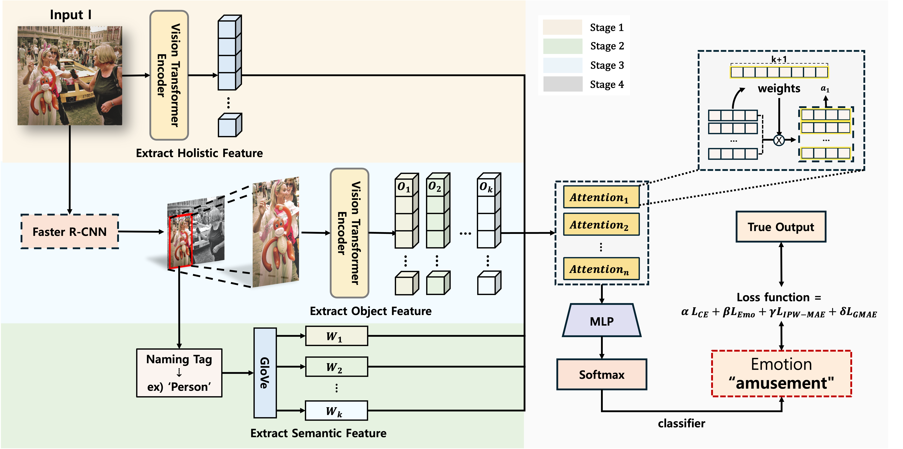

# BOVIS: Bias-Mitigated Object-Enhanced Visual Emotion Analysis

## Abstract
Visual emotion analysis is an emerging field that aims to predict emotional responses elicited by visual stimuli. While recent advances in deep learning have significantly improved emotion detection capabilities, existing methods often fall short by focusing exclusively on either holistic visual features or semantic content, neglecting their interplay. To address this limitation, we introduce BOVIS, a Bias-Mitigated Object-Enhanced Visual Emotion Analysis framework. 

In order to capture subtle relationships between visual and semantic features and enrich the understanding of emotional contexts, BOVIS leverages pre-trained models to extract comprehensive image features, integrate object-level semantics, and enhance contextual information. Additionally, BOVIS incorporates a bias mitigation strategy, which includes an adjusted Mean Absolute Error loss function combined with an Inverse Probability Weighting approach, to address dataset imbalances and improve fairness in emotion prediction.

Extensive evaluations on multiple benchmark datasets validate the effectiveness of the BOVIS framework in advancing visual emotion analysis. The results demonstrate that the synergy between object-specific features and holistic visual representations enhances the accuracy and interpretability of emotion analysis, while the bias mitigation optimization improves fairness and increases reliability.

## Model Architecture



## Installation
```bash
# Clone the repository
git clone https://github.com/leeyubin10/BOVIS.git

# Install dependencies
pip install -r requirements.txt
